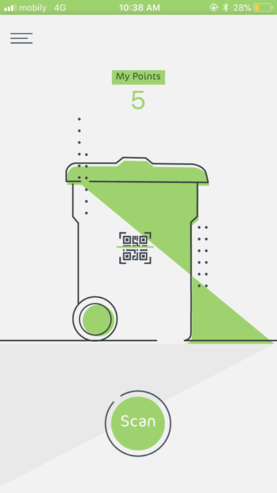
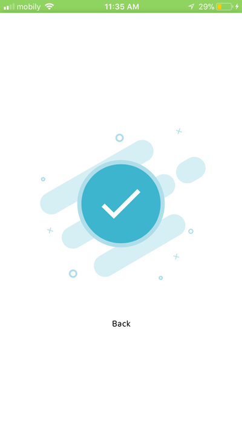

# Holify

## Screenshots

 

## Requirements
- [NodeJS](https://nodejs.org)
- The React Native CLI `npm install -g react-native-cli`
- Expo CLI `npm install expo-cli --global`
- Download Expo Client for [Android](https://play.google.com/store/apps/details?id=host.exp.exponent&referrer=www) or [iOS](https://itunes.apple.com/app/apple-store/id982107779) on your smartphone.

## Installation
- Open project's directory in command prompt.
- Run `yarn` or 'npm install'
- Follow Expo's CLI instructions.
